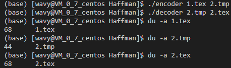
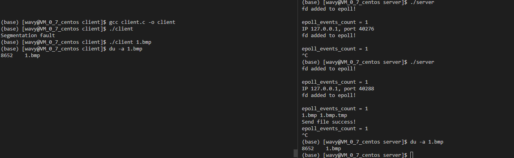

# FileTransfer
哈夫曼编码的文件传输（仅供练手）

## 相关理论技术

### 文件读写

就是普通的用c来读写二进制文件的啦。

### 堆

这里有一点点多余地实现了一个堆，用于构建哈夫曼树过程中获取频率最小的两个节点的过程。

### 哈夫曼编码

根据出现频率，对不同字符赋予不同的二进制编码。这里根据文件里的每8位当成一个字符来构建哈夫曼树。用一遍dfs构建哈夫曼编码（左0右1）.

### 文件压缩

构建完每个字符的哈夫曼编码后，就可以将每个字符转换成对应的编码了。注意文件一开始会写入压缩的一些信息，比如压缩后文件的比特位数（除去文件头的信息，因为压缩后文件的最后一个字节可能存在冗余比特位），编码的字符串的个数，以及每个字符串的出现频率（用于解码的哈夫曼树重构），还有几位用来校验是不是一个正确的压缩文件。文件写入的过程中每凑齐一个比特位写入一次文件。

### 文件解压

根据文件头信息还原哈夫曼树，然后根据每个比特在树上游走，每走到一个叶子节点就得到一个字符输出。

### 网络传输

利用socket的TCP服务，服务器使用io复用的epoll监听请求，使用边缘触发机制，每次有一个文件下载请求，服务器先进行哈夫曼编码压缩，然后传输二进制比特位给客户端。客户端收到压缩文件后再用上面的方法解压。中间会有一个临时文件生成（增加后缀.tmp），最后会删除。

## 环境配置

使用gcc直接编译运行即可（encoder和decoder是压缩解压的示意代码，server和client是文件传输的代码）。

## 运行

### 文件压缩

### 文件传输

